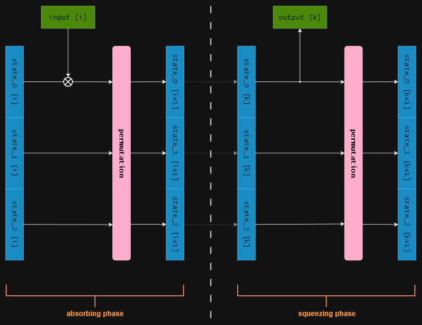
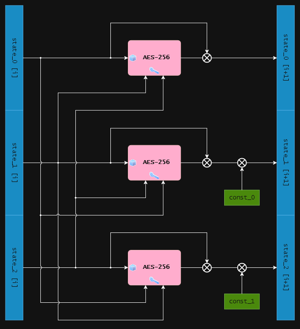

# SpongeHash-AES256

[](https://docs.rust-embedded.org/book/intro/no-std.html)
[](https://crates.io/crates/sponge-hash-aes256)
[](https://crates.io/crates/sponge-hash-aes256)
[](https://crates.io/crates/sponge-hash-aes256/versions)
[](https://docs.rs/sponge-hash-aes256/latest/)
[](https://opensource.org/license/0BSD)
[](https://codecov.io/gh/lordmulder/sponge-hash-aes256)


A [**sponge**](https://en.wikipedia.org/wiki/Sponge_function)-based secure hash function that uses [AES-256](https://docs.rs/aes/latest/aes/index.html) as its internal [PRF](https://en.wikipedia.org/wiki/Pseudorandom_permutation).

This hash function has a *variable* output size and can produce outputs of *any* non-zero size.

Please see the [**documentation**](https://lordmulder.github.io/sponge-hash-aes256/) for details! &#x1F4A1;

## Library

The “core” hash algorithm is implemented in the **`sponge-hash-aes256`** crate.

### Installation

In order to use this crate, add it under `[dependencies]` to your **`Cargo.toml`**:

```
[dependencies]
sponge-hash-aes256 = "1.8.1"
```

### Usage

Here is a simple example that demonstrates how to use `SpongeHash256` in your code:

```rust
use hex::encode_to_slice;
use sponge_hash_aes256::{DEFAULT_DIGEST_SIZE, SpongeHash256};

fn main() {
    // Create new hash instance
    let mut hash = SpongeHash256::default();

    // Process message
    hash.update(b"The quick brown fox jumps over the lazy dog");

    // Retrieve the final digest
    let digest = hash.digest::<DEFAULT_DIGEST_SIZE>();

    // Encode to hex
    let mut hex_buffer = [0u8; 2usize * DEFAULT_DIGEST_SIZE];
    encode_to_slice(&digest, &mut hex_buffer).unwrap();

    // Print the digest (hex format)
    println!("0x{}", str::from_utf8(&hex_buffer).unwrap());
}
```

## Command-line tool

The **`sponge256sum`** command-line tool, similar to [`sha256sum`](https://man7.org/linux/man-pages/man1/sha256sum.1.html) and friends:


### Usage

This command-line application can be used as follows:

```
Usage: sponge256sum [OPTIONS] [FILES]...

Arguments:
  [FILES]...  Files to be processed

Options:
  -b, --binary           Read the input file(s) in binary mode, i.e., default mode
  -t, --text             Read the input file(s) in text mode
  -c, --check            Read and verify checksums from the provided input file(s)
  -d, --dirs             Enable processing of directories as arguments
  -r, --recursive        Recursively process the provided directories (implies -d)
  -a, --all              Iterate all kinds of files, instead of just regular files
  -k, --keep-going       Continue processing even if errors are encountered
  -l, --length <LENGTH>  Digest output size, in bits (default: 256, maximum: 2048)
  -i, --info <INFO>      Include additional context information
  -s, --snail...         Enable "snail" mode, i.e., slow down the hash computation
  -q, --quiet            Do not output any error messages or warnings
  -p, --plain            Print digest(s) in plain format, i.e., without file names
  -0, --null             Separate digest(s) by NULL characters instead of newlines
  -m, --multi-threading  Enable multi-threaded processing of input files
  -f, --flush            Explicitly flush 'stdout' stream after printing a digest
  -T, --self-test        Run the built-in self-test (BIST)
  -h, --help             Print help
  -V, --version          Print version

If no input files are specified, reads input data from the 'stdin' stream.
Returns a non-zero exit code if any errors occurred; otherwise, zero.
```

## Algorithm

This section provides additional details about the SpongeHash-AES256 algorithm.

### Internal state

The state has a total size of 384 bits, consisting of three 128-bit blocks, and is initialized to all zeros at the start of the computation. Only the upper 128 bits are directly used for input and output operations.

### Update function

The “update” function, which *absorbs* input blocks into the state and *squeezes* the corresponding output from it, is defined as follows, where `input[i]` denotes the *i*-th input block and `output[k]` the *k*-th output block:



### Permutation function

The “permutation” function, applied to scramble the state after each absorbing or squeezing step, is defined as follows, where `AES-256` denotes the [AES](https://en.wikipedia.org/wiki/Advanced_Encryption_Standard) cipher with a key size of 256 bits and a block size of 128 bits.



The constants `const_0` and `const_1` are defined as full blocks filled with `0x5C` and `0x36`, respectively.

### Finalization

The padding of the final input block is performed by first appending a single `1` bit, followed by the minimal number of `0` bits needed to make the total message length a multiple of the block size.

Following the final input block, a 128-bit block filled entirely with `0x6A` bytes is absorbed into the state.

## Platform support

This crate uses Rust edition 2021, and requires `rustc` version 1.89.0 or newer.

The following targets are officially supported, other platforms may function but are **not** guaranteed:

- Linux
- Windows
- macOS
- *BSD (FreeBSD, OpenBSD, NetBSD, etc.)
- Haiku OS
- Solaris / Illumos

## Git repository

Official Git mirrors are available here:

- <https://github.com/lordmulder/sponge-hash-aes256>
- <https://codeberg.org/MuldeR/sponge-hash-aes256>
- <https://gitlab.com/lord_mulder/sponge-hash-aes256>
- <https://repo.or.cz/sponge-hash-aes256.git>

## License

This software is released under the BSD Zero Clause (“0BSD”) License.

Copyright (C) 2025-2026 by LoRd_MuldeR &lt;mulder2@gmx.de&gt;.
